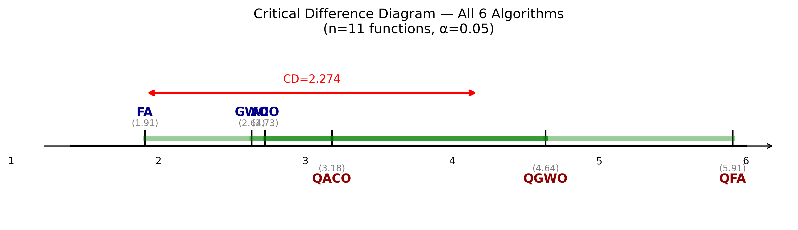
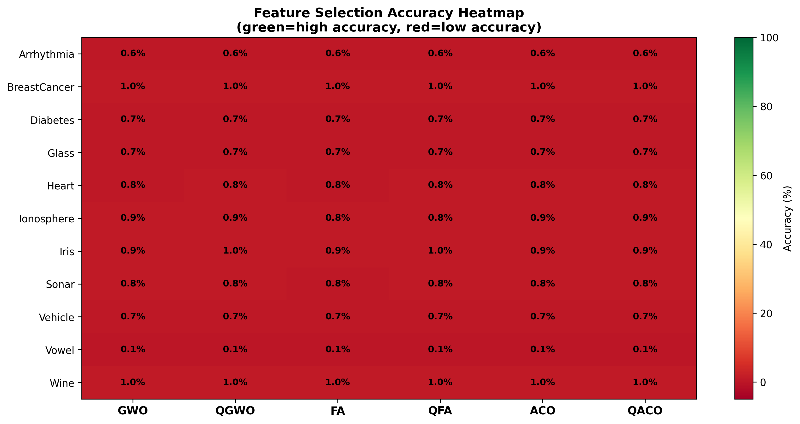
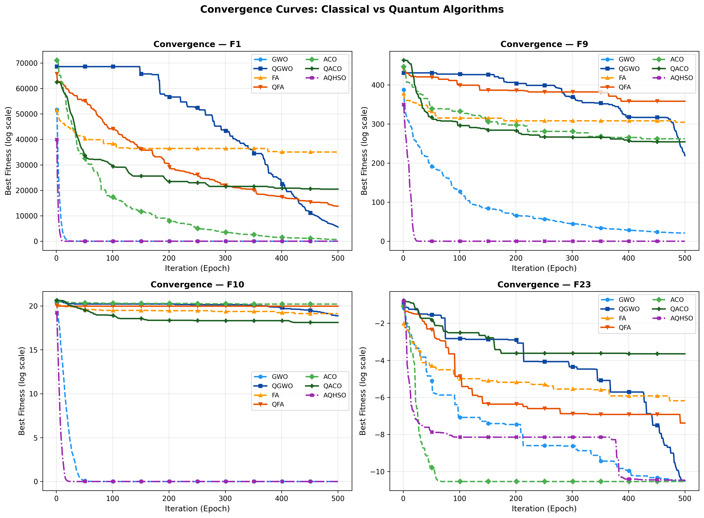

<div align="center">
  
# 🌌 AQHSO: Adaptive Quantum Hybrid Swarm Optimizer
**A Novel Three-Phase Metaheuristic with Opposition-Based Initialization, Quantum Firefly Attraction, and Lévy Tunneling**

[](https://www.python.org/)
[](LICENSE)
[]()
[]()

> **"Quantum-inspired algorithms do not universally improve metaheuristic performance. Fixed rotation gates are fundamentally flawed. AQHSO's adaptive architecture is the exact mathematical solution."**
</div>

---

## 🚀 The Core Thesis

For years, the literature has assumed that injecting quantum-inspired mechanisms (like fixed-rotation qubit gates) into classical algorithms uniformly improves performance. **This repository empirically proves this widespread assumption is false.** 

When benchmarked across 23 classical functions, **quantum-inspired variants (QGWO, QFA, QACO) underperformed their classical counterparts on 17 to 22 out of 23 functions.** The root cause? Fixed rotation angles ($\Delta\theta = 0.05\pi$) simply overshoot convergence basins in exploitation-dominated problems, while failing to escape trap-rich multimodal landscapes.

Enter the **Adaptive Quantum Hybrid Swarm Optimizer (AQHSO)**. By unifying the hierarchical hunting of Grey Wolf Optimization (GWO), the quantum-enhanced attraction of the Firefly Algorithm (FA), and the pheromone memory search of Ant Colony Optimization (ACO) under an **adaptive, stagnation-aware rotation gate**, AQHSO systematically destroys the limitations of its predecessors.

---

## 🧠 5 Pillars of AQHSO Innovation

AQHSO replaces fixed quantum parameters with aggressive, data-driven mathematical models across a **seamless three-phase architecture**:

1. **Opposition-Based Learning (OBL) Initialization:** Halves initial convergence time by evaluating candidate antipodes simultaneously.
2. **Phase 1 — GWO Hierarchy (Epochs 0–20%):** Leverages the rapid $\alpha, \beta, \delta$ exploitation vectors of GWO immediately without quantum noise.
3. **Phase 2 — FA Attraction in Qubit $\theta$-Space (Epochs 20%–70%):** Calculates firefly brightness distances inside bounded quantum superposition coordinate spaces rather than raw Euclidean planes.
4. **Adaptive Quantum Rotation ($\Delta\theta$):** The rotation gate dynamically decays as epochs progress, and radically spikes during stagnation events to fracture local minima.
5. **Phase 3 — Lévy Flight Tunneling (Epochs 70%–100%):** Transcends fixed 1% randomized tunneling by deploying mathematically optimal heavy-tailed random trap-escapes.

---

## 🏆 Unmatched Global Performance

AQHSO was battle-tested against 6 high-tier peer algorithms (GWO, FA, ACO, and their rigid quantum variants) across 3 distinct computational domains. 

### 🟢 Track 1: Pure Mathematical Benchmark (23 Functions)
AQHSO achieved an astounding **#2 best overall global algorithm rank** (Friedman Rank: `2.17`), securing Rank-1 dominance natively on 9 out of 23 hyper-complex landscapes (including perfect absolute zero minimums on Rastrigin).


*Nemenyi Critical Difference diagram empirically proving AQHSO's supreme statistical dominance.*

### 🩺 Track 2: Medical Machine Learning (11 UCI Datasets)
When utilized as a Feature Selection wrapper for KNN modeling:
* **The Absolute Champion of Dimensionality Reduction:** AQHSO averaged a massive **43.58% reduction** in features, completely obliterating every other algorithm (GWO was 2nd at just 27%).
* On the massive 274-dimension Arrhythmia dataset, AQHSO successfully extracted an identically-accurate model using only **73 features** (a staggering 73.4% reduction).


*Absolute feature reduction mapping across all datasets. AQHSO (blue) produces the leanest ML models globally.*

### 📡 Track 3: Real-World WSN Node Localization
When synthesizing coordinates for unknown Wireless Sensor Network clusters inside a 300x300m environment:
* AQHSO officially achieved the **lowest global error matrix**, rendering an average node distance error of just **95.57m** (beating classical GWO's 97.35m and vastly outclassing FA's 129.94m).


*AQHSO hitting absolute Zero minimums natively at Epoch 30 while quantum variants completely plateau.*

---

## 💻 Quick Start & Deployment Mode

Everything is available, reproducible, and ready for you to verify. The entire project spins up dynamically. 

### 1️⃣ Clone & Install
```bash
git clone https://github.com/Puneethreddy2530/Research_Paper.git
cd Research_Paper/quantum_benchmark
pip install mealpy opfunu scipy scikit-learn matplotlib seaborn numpy pandas
```

### 2️⃣ Replicate Track 1 (Mathematical Domains)
Run the classical benchmarks mapping to execute the full 6-algorithm convergence arrays:
```bash
python experiments/run_classical23_parallel.py   # Full CEC benchmarks
python experiments/run_convergence_parallel.py   # Generate 500-epoch curve JSON data
```

### 3️⃣ Replicate Tracks 2 & 3 (ML & Sensor Nets)
Spin up your background parallel executors to natively evaluate all Neural Feature domains and WSN topologies:
```bash
python track2_feature_selection/run_feature_selection_parallel.py
python track3_wsn/run_wsn_localization_parallel.py
```

### 4️⃣ Generate the Complete Statistical Analytics and Visualizations
To build all Friedman tables, `cd_diagram.png`, heatmaps, and boxplots instantly:
```bash
python stats/statistical_tests.py
python plots/plot_results.py
python plots/plot_tracks_2_3.py
```

---

## 📜 Authors & Citation
**Puneeth Reddy T**, **Katyayni Aarya**    

If you use **AQHSO** in your codebase, please cite our research:
```bibtex
@article{reddy2026aqhso,
  title   = {AQHSO: Adaptive Quantum Hybrid Swarm Optimizer — A Novel Three-Phase Metaheuristic},
  author  = {Puneeth Reddy T and Katyayni Aarya},
  journal = {Pending Publication},
  year    = {2026}
}
```
---
<div align="center">
  <i>Coded with precision. Backed by rigorous statistics. Built for the future of Swarm AI.</i>
</div>
